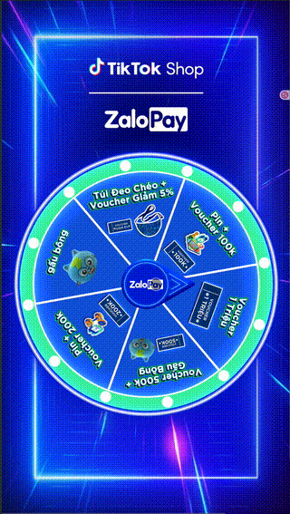
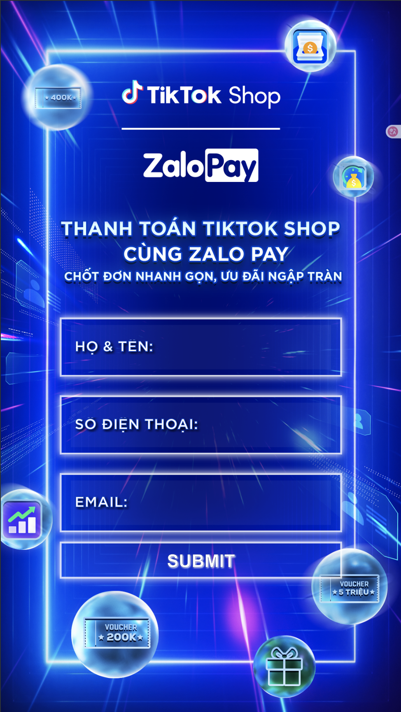

# Vòng Quay May Mắn (Spin Wheel Lucky Draw)

Ứng dụng vòng quay may mắn tương tác được xây dựng bằng React, dùng cho các sự kiện quay số trúng thưởng. Tích hợp animation mượt mà, hiệu ứng âm thanh và kết nối backend API.

## Tính năng

- **Form Đăng ký**: Thu thập thông tin người tham gia (họ tên, SĐT, email) với validation
- **Vòng quay tương tác**: Animation CSS mượt mà kèm hiệu ứng âm thanh
- **Hệ thống xác suất có trọng số**: Cấu hình phân phối giải thưởng dựa trên số lượng
- **Quản lý giải thưởng real-time**: Tự động cập nhật số lượng qua REST API
- **Chống đăng ký trùng**: Ngăn người dùng tham gia nhiều lần
- **Responsive Design**: Hoạt động tốt trên cả desktop và mobile

## Công nghệ sử dụng

- **Frontend**: React 18, React Router v6
- **HTTP Client**: Axios
- **Styling**: CSS3 với custom animations
- **Build Tool**: Create React App
- **Deployment**: Hỗ trợ Vercel

## Demo

<p align="center">
  
</p>

## Screenshots

<p align="center">
  
</p>

<p align="center"><em>Trang đăng ký thông tin người tham gia</em></p>

## Hướng dẫn cài đặt

### Yêu cầu

- Node.js 16+
- npm hoặc pnpm

### Cài đặt

1. Clone repository
```bash
git clone https://github.com/yourusername/spinwheel-luckydraw.git
cd spinwheel-luckydraw
```

2. Cài đặt dependencies
```bash
npm install
```

3. Cấu hình environment variables
```bash
cp .env.example .env
```

Chỉnh sửa file `.env` với cấu hình API của bạn:
```
REACT_APP_API_URL=https://your-api-domain.com
REACT_APP_API_USERNAME=your_username
REACT_APP_API_PASSWORD=your_password
```

4. Chạy development server
```bash
npm start
```

Ứng dụng sẽ chạy tại [http://localhost:3000](http://localhost:3000)

### Build cho Production

```bash
npm run build
```

## Cấu trúc Project

```
src/
├── assets/
│   ├── fonts/          # Font tùy chỉnh
│   ├── images/         # Hình nền và vòng quay
│   └── music/          # Âm thanh quay
├── components/
│   ├── Registration.js # Form đăng ký
│   ├── Registration.css
│   ├── SpinWheel.js    # Component vòng quay
│   └── SpinWheel.css
├── App.js              # App chính với routing
└── index.js            # Entry point
```

## API Endpoints

Ứng dụng yêu cầu REST API với các endpoint sau:

| Method | Endpoint | Mô tả |
|--------|----------|-------|
| GET | `/giftset/` | Lấy danh sách giải thưởng |
| PATCH | `/giftset/:id/` | Cập nhật số lượng giải |
| POST | `/registrator/` | Đăng ký người tham gia mới |
| GET | `/registrator/get_latest/` | Lấy đăng ký mới nhất |
| GET | `/registrator/:id/` | Lấy thông tin đăng ký theo ID |
| PATCH | `/registrator/:id/` | Cập nhật thông tin đăng ký |

## Tùy chỉnh

### Thay đổi giải thưởng

Cập nhật hình vòng quay (`src/assets/images/wheel.png`) và cấu hình giải thưởng qua backend API.

### Thay đổi giao diện

Chỉnh sửa các file CSS trong `src/components/` để tùy chỉnh màu sắc, font và layout.

## Deploy

### Vercel (Khuyến nghị)

[](https://vercel.com/new/clone?repository-url=https://github.com/yourusername/spinwheel-luckydraw)

Nhớ thêm environment variables trong Vercel dashboard.

### Nền tảng khác

Build project và deploy thư mục `build/` lên bất kỳ static hosting service nào.

## License

MIT License - Thoải mái sử dụng project này cho sự kiện của bạn!

---

Xây dựng với React
